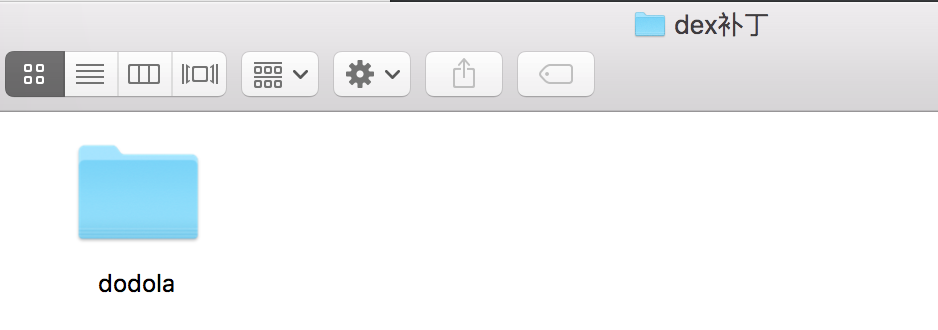
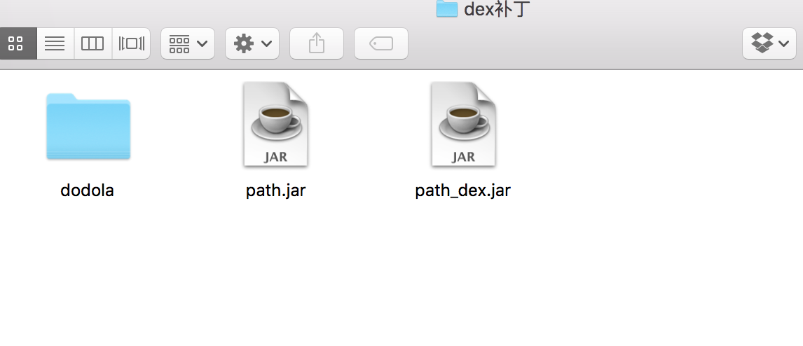

# HotFix
安卓App热补丁动态修复框架

##介绍
该项目是基于QQ空间终端开发团队的技术文章实现的，完成了文章中提到的基本功能。

文章地址：[安卓App热补丁动态修复技术介绍](http://mp.weixin.qq.com/s?__biz=MzI1MTA1MzM2Nw==&mid=400118620&idx=1&sn=b4fdd5055731290eef12ad0d17f39d4a&scene=0#wechat_redirect)

项目部分代码从 [dalvik_patch](https://github.com/simpleton/dalvik_patch) 项目中修改而来，这个项目本来是用来实现multidex的，发现可以用来实现方法替换的效果。

项目包括核心类库，补丁制作库，例子。可以直接运行代码看效果。


##详细说明
###补丁制作
该技术的原理很简单，其实就是用ClassLoader加载机制，覆盖掉有问题的方法。所以我们的补丁其实就是有问题的类打成的一个包。

例子中的出现问题的类是 `dodola.hotfix.BugClass` 
原始代码如下：

```java
public class BugClass {

    public String bug() {
        return "bug class";
    }
}
```

我们假设`BugClass`类里的`bug()`方法出现错误，需要修复，修复代码如下：

```java

public class BugClass {

    public String bug() {
        return "fixed class";
    }
}

```

那么我们只需要将修复过的类编译后打包成dex即可

步骤如下：

1. 将补丁类提取出来到一个文件夹里    


2. 将class文件打入一个jar包中 `jar cvf path.jar *`
3. 将jar包转换成dex的jar包 `dx --dex --output=path_dex.jar path.jar`

这样就生成了补丁包`path_dex.jar`




###开发Gradle插件实现javassist动态代码注入

###补丁加载过程分析


##ISSUE
开发测试过程中遇到一些问题，这种方法无法在已经加载好的类中实现动态替换，只能在类加载之前替换掉。就是说，补丁下载下来后，只能等待用户重启应用才能完成补丁效果。