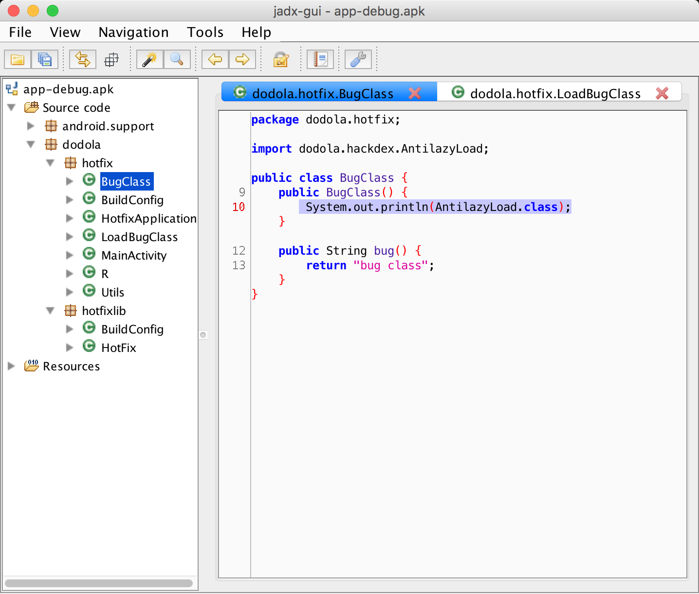

# HotFix
安卓App热补丁动态修复框架

##介绍
该项目是基于QQ空间终端开发团队的技术文章实现的，完成了文章中提到的基本功能。

文章地址：[安卓App热补丁动态修复技术介绍](http://zhuanlan.zhihu.com/magilu/20308548)

项目部分代码从 [dalvik_patch](https://github.com/simpleton/dalvik_patch) 项目中修改而来，这个项目本来是用来实现multidex的，发现可以用来实现方法替换的效果。

项目包括核心类库，补丁制作库，例子。可以直接运行代码看效果。

**文章作者Github:** [jiqimaogou](https://github.com/jiqimaogou)
希望作者补充一下开发过程中遇到的坑😂


##详细说明
###补丁制作
该技术的原理很简单，其实就是用ClassLoader加载机制，覆盖掉有问题的方法。所以我们的补丁其实就是有问题的类打成的一个包。

例子中的出现问题的类是 `dodola.hotfix.BugClass` 
原始代码如下：

```java
public class BugClass {

    public String bug() {
        return "bug class";
    }
}
```

我们假设`BugClass`类里的`bug()`方法出现错误，需要修复，修复代码如下：

```java

public class BugClass {

    public String bug() {
        return "fixed class";
    }
}

```

那么我们只需要将修复过的类编译后打包成dex即可

步骤如下：

1. 将补丁类提取出来到一个文件夹里    


2. 将class文件打入一个jar包中 `jar cvf path.jar *`
3. 将jar包转换成dex的jar包 `dx --dex --output=path_dex.jar path.jar`

这样就生成了补丁包`path_dex.jar`


###实现javassist动态代码注入


实现这一部分功能的原因主要是因为出现如下异常

`                                                             java.lang.IllegalAccessError: Class ref in pre-verified class resolved to unexpected implementation
`

问题原因在文档中已经描述的比较清楚。

> 
就是如果以上方法中直接引用到的类（第一层级关系，不会进行递归搜索）和clazz都在同一个dex中的话，那么这个类就会被打上**CLASS_ISPREVERIFIED**

很明显，解决的方法就是在类中引用一个其他dex中的类，但是源码方式的引用会将引用的类打入同一个dex中，所以我们需要找到一种既能编译通过并且将两个互相引用的类分离到不同的dex中，于是就有了这个动态的代码植入方式。

首先我们需要制作引用类的dex包，代码在`hackdex`中，我直接使用了文档中的类名 `AntilazyLoad` 这样可以和文章中对应起来，方便一些。

我们将这个库打包成dex的jar包，方法跟制作补丁一样。

下面是重点，我们要用`javassist`将这个类在编译打包的过程中插入到目标类中。

为了方便，我将这个过程做成了一个Gradle的Task，代码在`buildSrc`中。

这个项目是使用Groovy开发的，需要配置Groovy SDK才可以编译成功。

核心代码如下：

```groovy
 /**
     * 植入代码
     * @param buildDir 是项目的build class目录,就是我们需要注入的class所在地
     * @param lib 这个是hackdex的目录,就是AntilazyLoad类的class文件所在地
     */
    public static void process(String buildDir, String lib) {

        println(lib)
        ClassPool classes = ClassPool.getDefault()
        classes.appendClassPath(buildDir)
        classes.appendClassPath(lib)

        //下面的操作比较容易理解,在将需要关联的类的构造方法中插入引用代码
        CtClass c = classes.getCtClass("dodola.hotfix.BugClass")
        println("====添加构造方法====")
        def constructor = c.getConstructors()[0];
        constructor.insertBefore("System.out.println(dodola.hackdex.AntilazyLoad.class);")
        c.writeFile(buildDir)


        CtClass c1 = classes.getCtClass("dodola.hotfix.LoadBugClass")
        println("====添加构造方法====")
        def constructor1 = c1.getConstructors()[0];
        constructor1.insertBefore("System.out.println(dodola.hackdex.AntilazyLoad.class);")
        c1.writeFile(buildDir)


        growl("ClassDumper", "${c.frozen}")
    }
```

下面在代码编译完成，打包之前，执行植入代码的task就可以了。

在 app 项目的 build.gradle 中插入如下代码

```groovy
task('processWithJavassist') << {
    String classPath = file('build/intermediates/classes/debug')//项目编译class所在目录
    dodola.patch.PatchClass.process(classPath, project(':hackdex').buildDir
            .absolutePath + '/intermediates/classes/debug')//第二个参数是hackdex的class所在目录

}

android{
   .......
    applicationVariants.all { variant ->
        variant.dex.dependsOn << processWithJavassist //在执行dx命令之前将代码打入到class中
    }
}

```

反编译编译后的apk可以发现，代码已经植入进去，而且包里并不存在` dodola.hackdex.AntilazyLoad` 这个类




###补丁加载过程分析


##ISSUE
1. 开发测试过程中遇到一些问题，这种方法无法在已经加载好的类中实现动态替换，只能在类加载之前替换掉。就是说，补丁下载下来后，只能等待用户重启应用才能完成补丁效果。
2. 有同学反馈在一加手机上会出现` Class ref in pre-verified class resolved to unexpected`的错误，待找到手机后修复。。